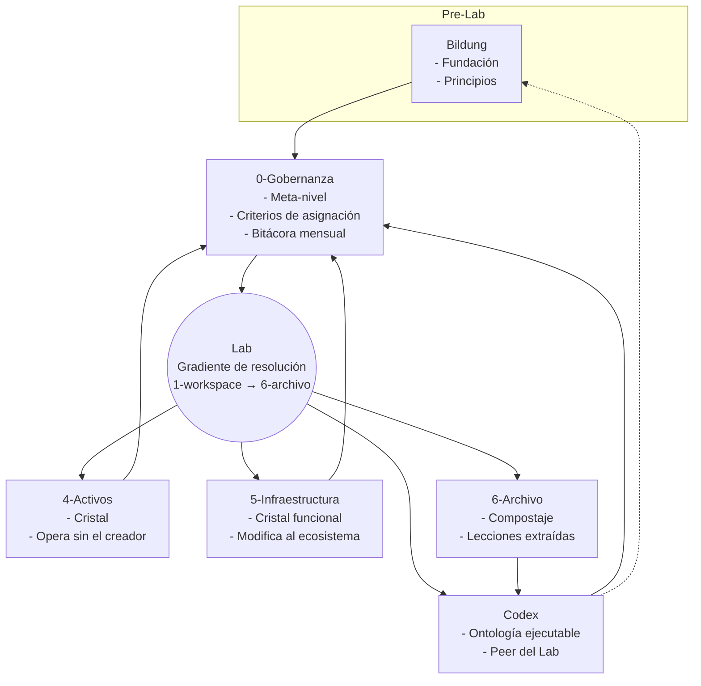
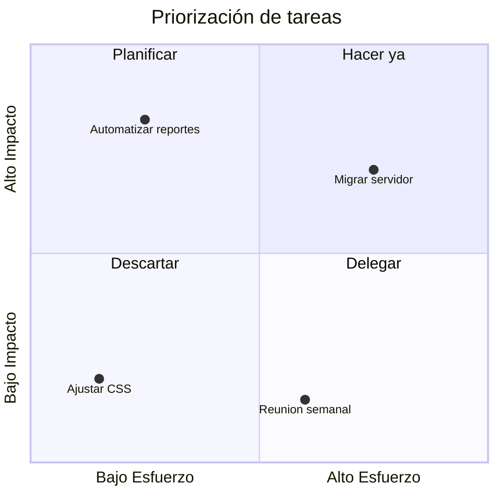

## Bildung

> Modelo actual (Agosto 2026). Refleja el pipeline de resolución del Lab, la co-evolución Codex ↔ Gobernanza, y la Fundación como capa pre-Lab.

```mermaid
graph
  subgraph pre_lab [Pre-Lab]
    f[Bildung<br>- Fundación<br>- Principios]
  end

  f --> g[0-Gobernanza<br>- Meta-nivel<br>- Criterios de asignación<br>- Bitácora mensual]
  g --> lab((Lab<br>Gradiente de resolución<br>1-workspace → 6-archivo))

  lab --> codex[Codex<br>- Ontología ejecutable<br>- Peer del Lab]
  lab --> activos[4-Activos<br>- Cristal<br>- Opera sin el creador]
  lab --> infra[5-Infraestructura<br>- Cristal funcional<br>- Modifica al ecosistema]
  lab --> archivo[6-Archivo<br>- Compostaje<br>- Lecciones extraídas]

  codex --> g
  codex -.-> f

  infra --> g
  activos --> g
  archivo --> codex
```

```mermaid
quadrantChart
    title Priorización de tareas
    x-axis Bajo Esfuerzo --> Alto Esfuerzo
    y-axis Bajo Impacto --> Alto Impacto
    quadrant-1 Hacer ya
    quadrant-2 Planificar
    quadrant-3 Descartar
    quadrant-4 Delegar
    Automatizar reportes: [0.25, 0.82]
    Migrar servidor: [0.75, 0.7]
    Ajustar CSS: [0.15, 0.2]
    Reunion semanal: [0.6, 0.15]
```
